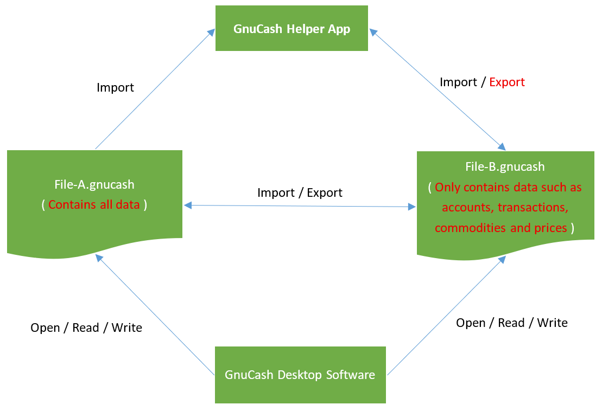

# 'GnuCash Helper' FAQ

## How does 'GnuCash Helper App' work in conjunction with 'GnuCash Desktop Software'?
As shown in the figure below, 
1. The 'File-B.gnucash' file can serve as an exchange file between 'GnuCash Helper App' and 'GnuCash Desktop Software'.
    1. Edit 'File-B.gnucash' using 'GnuCash Desktop Software'; 
    2. Import data from 'File-B.gnucash' using 'GnuCash Helper App'; 
    3. Use 'GnuCash Helper App' to record personal financial information anytime, anywhere; 
    4. Export data to 'File-B.gnucash' using 'GnuCash Helper App'; 
    5. Repeat steps a, b, c, and d.
2. The 'File-B.gnucash' file exported by app only contains data such as accounts, transactions, commodities and prices, so do not use the exported file to overwrite 'File-A.gnucash' file containing all the data. 
3. 'File-A.gnucash' file and 'File-B.gnucash' file can exchange data using the import and export features of 'GnuCash Desktop Software'. See also: [6.16. Importing Transactions from Files](https://gnucash.org/docs/v5/C/gnucash-manual/trans-import.html) / [6.17. Exporting Transactions](https://lists.gnucash.org/docs/C/gnucash-manual/trans-export.html)
4. Please be careful to back up your important files frequently.

