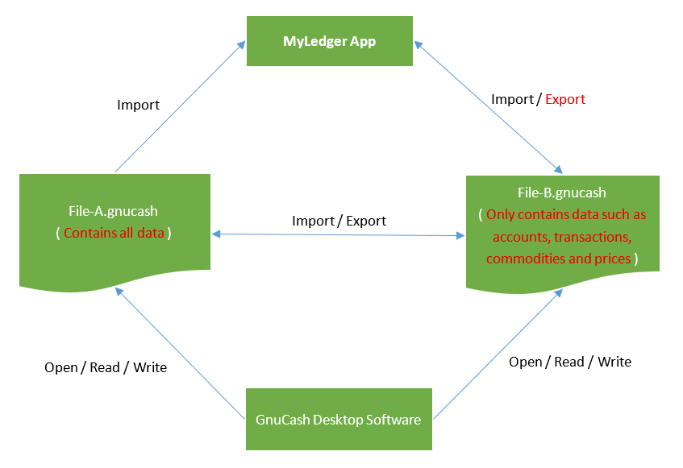

# 'MyLedger: GnuCash Companion' FAQ

## Contents
* [What is the relationship between 'MyLedger App' and 'GnuCash Desktop Software'?](#what-is-the-relationship-between-myledger-app-and-gnucash-desktop-software)
* [How does 'MyLedger App' work in conjunction with 'GnuCash Desktop Software'?](#how-does-myledger-app-work-in-conjunction-with-gnucash-desktop-software)

## What is the relationship between 'MyLedger App' and 'GnuCash Desktop Software'?
1. MyLedger is a companion mobile app for GnuCash (desktop software) . You can import the data from GnuCash, and record transactions on-the-go in the app, and later export the data into GnuCash.
2. MyLedger can also serve as a standalone personal finance app without using the GnuCash software. It tracks bank accounts, stocks, income and expenses etc. It is based on formal double-entry accounting principles. When you need the powerful features of GnuCash (like the reporting feature), you can export data as a GnuCash file and open it with GnuCash.
3. MyLedger and GnuCash use the same concept. If you are familiar with using GnuCash, you will also be familiar with using MyLedger. Please refer to: [GnuCash Tutorial and Concepts Guide](https://www.gnucash.org/viewdoc.phtml?rev=5&lang=C&doc=guide)

## How does 'MyLedger App' work in conjunction with 'GnuCash Desktop Software'?
As shown in the figure below, 
1. The 'File-B.gnucash' file can serve as an exchange file between 'MyLedger App' and 'GnuCash Desktop Software'.
    1. Edit 'File-B.gnucash' using 'GnuCash Desktop Software'; 
    2. Import data from 'File-B.gnucash' using 'MyLedger App'; 
    3. Use 'MyLedger App' to record personal financial information anytime, anywhere; 
    4. Export data to 'File-B.gnucash' using 'MyLedger App'; 
    5. Repeat steps a, b, c, and d.
2. The 'File-B.gnucash' file exported by app only contains data such as accounts, transactions, commodities and prices, so do not use the exported file to overwrite 'File-A.gnucash' file containing all the data. 
3. 'File-A.gnucash' file and 'File-B.gnucash' file can exchange data using the import and export features of 'GnuCash Desktop Software'. See also: [6.16. Importing Transactions from Files](https://gnucash.org/docs/v5/C/gnucash-manual/trans-import.html) / [6.17. Exporting Transactions](https://lists.gnucash.org/docs/C/gnucash-manual/trans-export.html)
4. Please be careful to back up your important files frequently.

<!-- 以下代码有效
# cccccccc

# dddddddd

-->

<!-- 以下代码无效
# aaaaaaaa

# bbbbbbbb

-->